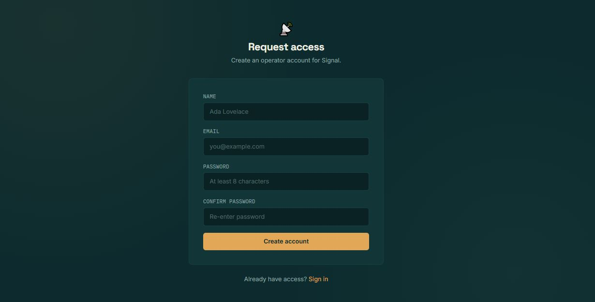
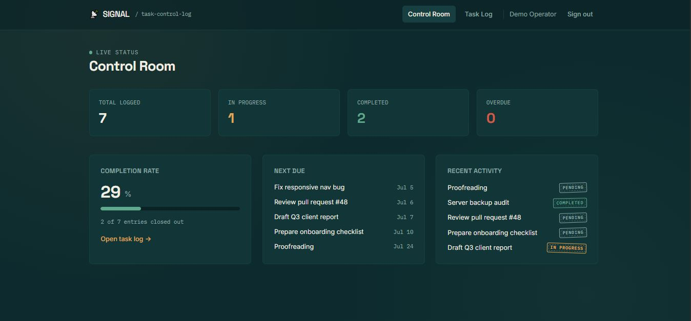
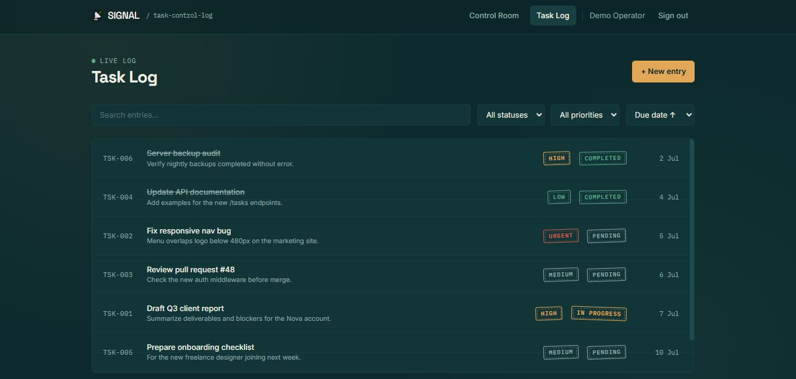
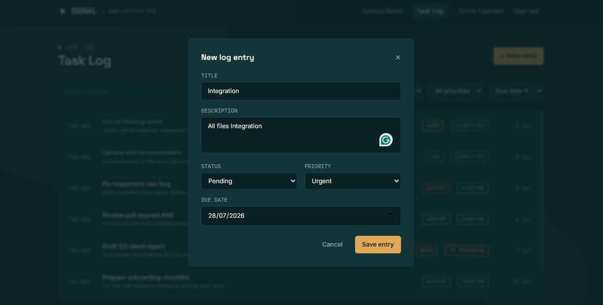

# Signal 📡✅
A full-stack task management platform styled as a mission-control log, 
built to demonstrate a complete PHP + MySQL backend paired with a 
Tailwind CSS and vanilla JavaScript frontend.
## 🌐 Live Demo
🔗 https://signal.infinityfree.me
## 📋 About the Project
Signal lets users log in, create and track tasks with status and 
priority, and monitor progress from a live dashboard. Every task is 
treated like a control-room log entry — stamped with a status badge, 
a ticket ID, and a due date — and updates happen instantly through a 
JSON API with no page reloads. The dashboard pulls its stats directly 
from MySQL, giving a real-time view of completion rate, overdue 
items, and recent activity.
## 📸 Screenshots
| Sign In | Control Room |
|-----------|-------------|
|  |  |
| Task Log | New Entry |
|-----------|---------|
|  |  |
## ✨ Key Features
### 🔐 Authentication
- Registration with server-side validation
- Secure login with bcrypt password hashing
- Session-based access control on every protected page and API route
### 📋 Task Log
- Create, edit, and delete tasks in real time via a JSON API
- Set status (pending / in progress / completed) and priority (low / medium / high / urgent)
- Assign and track due dates, with overdue items flagged automatically
- Live search across titles and descriptions
- Filter by status or priority, and sort by due date, priority, or newest
### 📊 Control Room Dashboard
- Total tasks, in-progress count, completed count, and overdue count
- Completion rate calculated straight from MySQL aggregate queries
- Upcoming tasks by due date
- Recent activity feed
## 🛠️ Technologies Used
### Frontend

### Backend

## 🚀 Getting Started
1. Clone the repo and place it in your local server directory (e.g. `htdocs`)
2. Import the schema: `mysql -u root -p < schema.sql`
3. Update credentials in `config/db.php` if needed
4. Visit the project in your browser and sign in

Full setup instructions are in the repo.
## 🔐 Demo Login Credentials
- **Email:** demo@signal.dev
- **Password:** password123
---
## 👩‍💻 Developer Contact
**Ayesha Amjad** — Front-End Developer & Digital Marketing Specialist
📧 ayeshaamjad819@gmail.com
🌐 Live Project: https://signal.infinityfree.me
🔗 github.com/AyeshaCodes25

---

## 🏫 Institution
📍 GC University Faisalabad — Department of Information Technology
